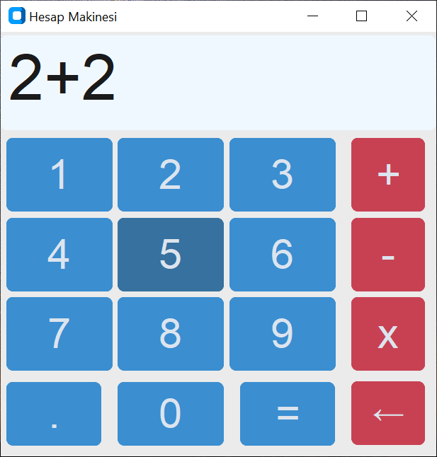

# Hesap Makinesi
Geliştirmeye başladığım yeni bir proje. İlk defa nesne tabanlı UI programı yazıyorum. Sıradan bir hesap makinesi programıdır.
## indirme
### Python Kodu: <a href="">İndir</a>
Python kodu yorumlayıcısı ile çalışabilir, bu yorumlayıcı olduğu sürece bütün işletim sistemlerinde, mimari fark etmeksizin çalışır.
### Exe for Windows: <a href=""https://github.com/YigitC7/HesapMakinesiApp/releases/download/2025.03.09/Hesap.MakinesiApp.exe>İndir</a>
Exe bin dosyası Windows 10-11 64 Bit için uygundur.

