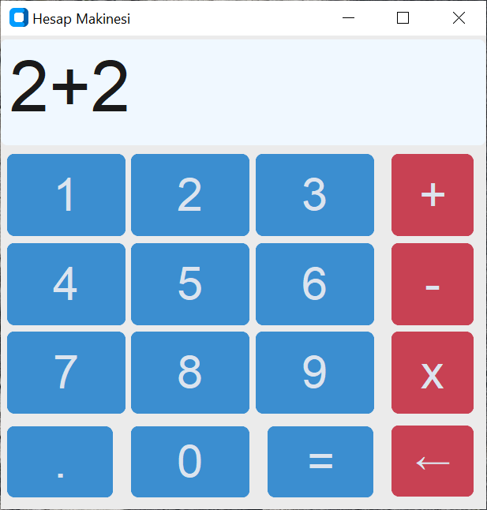

  

# Hesap Makinesi

  

Geliştirmeye başladığım yeni bir proje. İlk defa nesne tabanlı GUI programı yazıyorum. Sıradan bir hesap makinesi programıdır. Örenk bir proje olarak yapılmıştır ve isteyen kullanabilir.
## indirme
### Python Kodu: <a href="https://github.com/YigitC7/HesapMakinesiApp/releases/download/2025.03.11/main.py">İndir</a>
Python kodu, yorumlayıcısı ile çalışabilir. Bu yorumlayıcı olduğu sürece bütün işletim sistemlerinde, mimari fark etmeksizin çalışır.
### Windows exe: <a href="https://github.com/YigitC7/HesapMakinesiApp/releases/download/2025.03.11/Hesap.MakinesiApp.exe">İndir</a>
Exe bin dosyası Windows 10-11 64 Bit için uygundur.

